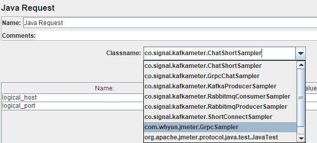
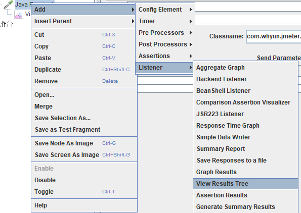
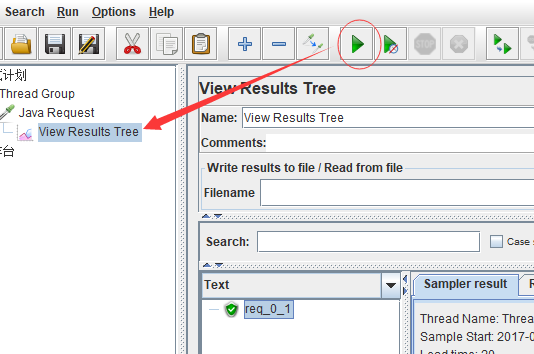

# The jmeter client for grpc

For benchmark test of the performance of grpc in node, I wrote a [demo](https://github.com/yunnysunny/bench4grpc). But it's hard to write a dead loop in Node.js to send request to the grpc server. So I wrote this project, use jmeter to send request to test the grpc server run in Node.js.

## How to use
1. Create jar library

```mvn package```

After run , it will create a jar in `target\jmeter4grpc-0.0.1.jar`. Copy it to the jmeter's `lib/ext` directory.

2. Create a jmeter project

Open jmeter GUI, right click the `Test Plan`, and then select the `Thread Group`.


Then right click the `Thread Group` menu, created just now, and select `Java Request`.


Double click the `Java Request` menu, and select `com.whyun.jmeter.GrpcSampler`.



Then set the paramters of the java request:


3. Check whether the jmeter project is OK

Right click the menu of `Java Request` , and create a result tree listener:



Click the `Start` button to start the test, and view the result in `View Results Tree`:



4. Start test

Double click the menu of `Thread Group`, and input `Number of Threads(users)`, 3 for example. And select `Forever` for `Loop Count`.

Save current project, and you will get a project file , let's assume it named `grpc_bench.jmx`. Then run such command:

`jmeter_dir/bin/jmeter -n -t grpc_bench.jmx -l the_result_log -e -o output_dir/``
